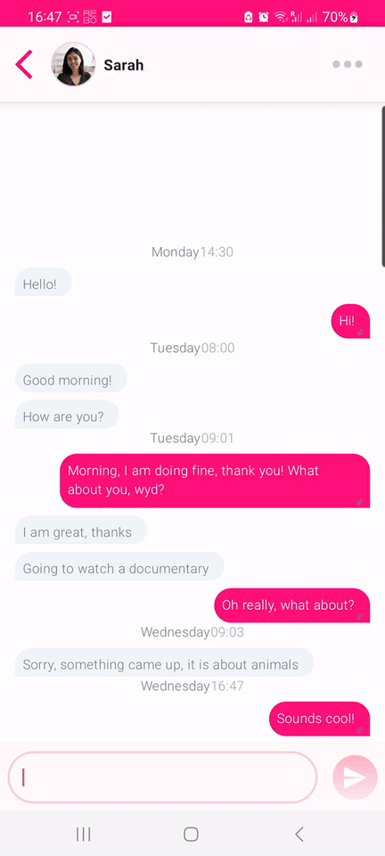

# Mchat

An example social media chat screen made with Kotlin and Jetpack compose

## Assumptions

The application is an example application with the following assumptions made:
- The application can only be run in portrait mode (as no landscape or other screen property examples have been provided)
- The application allows users to chat via direct messages (no group chats) that contain only String messages (read more in the data section)
- The application is preloaded with assets and SQL DB data
- The ChatScreen does not need to provide user-initiated or system-initiated process death, as that is the behaviour of most chat applications

## Architecture

- The application uses a single module clean architecture with a package structure in which packages "play" the role of modules. This splits the 
code into 3 layers: Data, Domain and Presentation and is done because of the size of the application. Otherwise I would have preferred a
feature AND layer modularization strategy.
- The application employs a repository pattern with an abstract repository interface, which is implemented both by the actual implementation and the
fake implementation used in tests.
- The application utilizes the MVI pattern, where the ChatScreen has an accompanying ChatViewModel.
- UI Components are broken down and implemented in their own files within the presentation.components package using Jetpack Compose
- Dagger-Hilt is used to provide DependencyInjection (see the di package)

## Data Layer

- The data layer hosts the classes and files for local Room DB creation as well as the Room DAO.
- The data layer hosts the real implementation of the repository
- The DB has the following simple schema:
  

## Domain Layer

- The domain layer is the link between the data and presentation layers
- The domain layer hosts the models, use cases, mappers and the repository abstraction

## Presentation Layer

- The presentation layer holds the UI components and the ChatScreen UI and VM

## Further Work

Given more time the following adjustments could be made:
- Pagination mechanism for loading messages. With the current approach the messages are stored in memory, but in a real chat application some sort of pagination mechanism would be required
- The current implementation hardcodes the current user's author ID for simplicity. This should come from the back-end and petentially be stored in Preferences
- Support for group conversations with multiple authors. 
